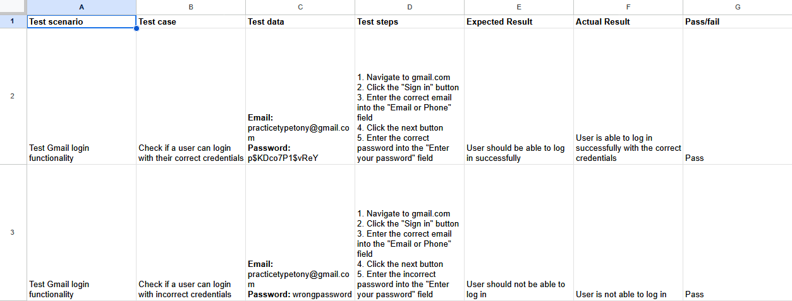

# Software Testing

Course: [Software Testing: Get A Tech Job in Software Testing 2025 - Waqas Mazhar](https://www.udemy.com/course/get-a-job-in-technology-without-experience/)

This course focuses on the fundamentals of QA/Software testing. I plan to include some notes here, as well as examples of my projects and work.

## Testing Software & Writing Test Cases

Below, I created two test cases to test Gmail login functionality for the email `practicetypetony@gmail.com`.

- The first case tests if the user can log in with their correct credentials.
- The second case tests if the user can log in with incorrect credentials.

## Terminology

### Software Development Life Cycle (SDLC)

The SDLC is a framework of activities performed during the software development process.

| Phase | Key activities | Deliverables |
|-------|-------------|--------------|
| 1. Planning | Identify project scope, goals, and requirements | Initial project plan | 
| 2. Analysis | Gather and review data on project requirements | Fully detailed requirement documentation |
| 3. Design | Define project architecture | Software design document (SDD) |
| 4. Coding | Writing inital code | Functional software prototype |
| 5. Testing | Review code and eliminate bugs | Refined, optimized software |
| 6. Deployment | Deploy code to production environment | Software available to end users |
| 7. Maintenance | Continual fixes and improvements | Updated and optimized code |

[Table source](https://www.ibm.com/think/topics/sdlc)
